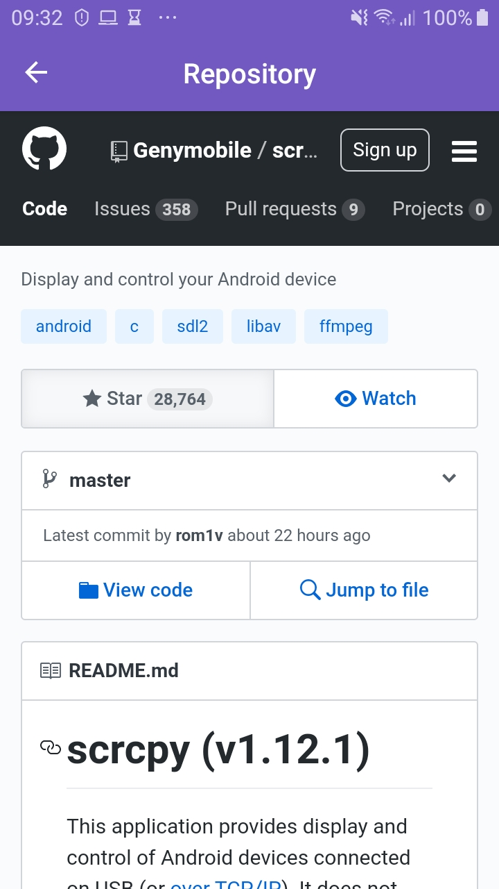
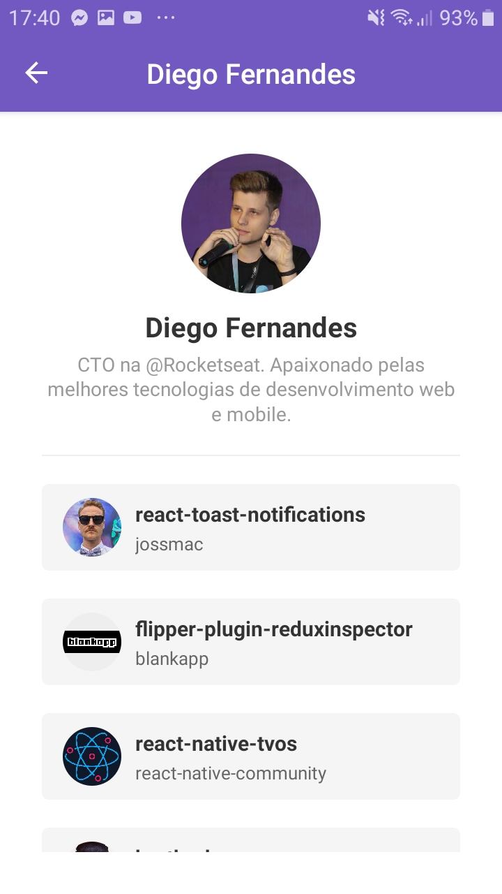

<h1 align="center">Bootcamp Gostack React Native</h1>

<h2 align="center">Desafio 6: Primeiro projeto com React Native</h2>

**[Detalhes do desafio](https://github.com/Rocketseat/bootcamp-gostack-desafio-06)** :rocket:

<h2 align="center">Resultado do desafio</h2>

    

